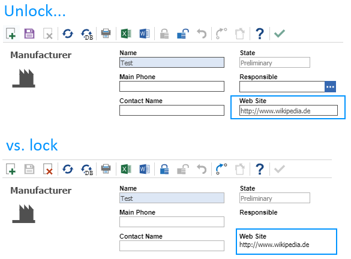

# Ways to add hyperlinks

## Description

This project shows ways to use hyperlinks in Aras. The current sample works with ItemType **Manufacturer**

## Project Details

#### Built Using:
Aras 11.0 SP11

#### Versions Tested:
Aras 11.0 SP11

#### Browsers Tested:
Internet Explorer 11, Chrome 66.0, Firefox ESR 52.7.4

## Usage

1. Open Form of ItemType **Manufacturer**
2. Create a new html element with name **html_web_site** and label **Web Site**
3. Add following HTML code to the new html element: ****
4. Place this html element over the existing **web_site** property. Use x / y values of property web_site for exact positioning
5. Untick visibilty button
6. Create a new Method and add attached js code
7. Use the Method as onFormPopulated event
8. Hyperlink is now editable when Manufacturer is in edit mode, but is displayed as hyperlink when locked. 

## Contributing

1. Fork it!
2. Create your feature branch: `git checkout -b my-new-feature`
3. Commit your changes: `git commit -am 'Add some feature'`
4. Push to the branch: `git push origin my-new-feature`
5. Submit a pull request

## Credits

Created by @AngelaIp

## License

This project is published to Github under the Microsoft Public License (MS-PL). See the [LICENSE file](./LICENSE.md) for license rights and limitations.